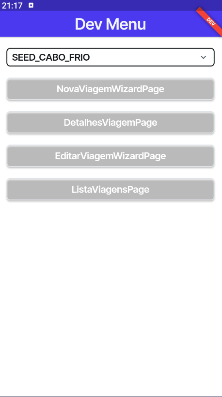

# App Viagens — FlutterFlow + Firebase

[](https://github.com/leomoraesitu/app-viagens/releases/tag/v1.0.0)
[](https://github.com/leomoraesitu/app-viagens/releases/tag/v1.0.1-planned)
[](https://github.com/leomoraesitu/app-viagens/releases)
[](./CHANGELOG.md)


---

## 📖 Sobre o Projeto

O **App Viagens** é um projeto de portfólio desenvolvido com **FlutterFlow + Firebase**, com foco em **Engenharia de Software**, **qualidade de código**, **arquitetura modular**, **separação de ambientes (Dev/Prod)** e **boas práticas de versionamento**.

O objetivo do projeto é demonstrar, de forma prática, a construção de um aplicativo completo, com governança técnica, controle de releases, testes automatizados e documentação estruturada.

### Funcionalidades principais
- Criar, listar, visualizar e editar viagens
- Favoritar destinos visitados
- Persistência de dados com Firebase Firestore
- Observabilidade com Google Analytics 4 (GA4)
- Feature Flags por ambiente
- Hotfixes versionados seguindo SemVer

---

## 📱 Demonstração das telas

| Home | Criar | Detalhes | Editar | Web | DevMenu |
|------|-------|----------|--------|------------|---------|
|  |  |  |  |  |  |


---

## 🌐 Acesso rápido

- 🌍 **Versão Web**  
  https://app-viagens-leomoraes.flutterflow.app

- 📱 **APK Android**  
  Disponível em **GitHub Releases**

- 📄 **Histórico técnico**  
  [`CHANGELOG.md`](./CHANGELOG.md)

---

## ⚙️ Funcionalidades

- 📌 CRUD completo de viagens
- ⭐ Favoritos visitados
- ☁️ Firebase Firestore
- 📊 Eventos e métricas com GA4
- 🧩 Feature Flags via JSON
- 🧭 Ambientes isolados (Dev / Production)
- 🛠️ Widgets customizados em Dart
- 🔁 Hotfixes controlados por release

---

## 🧪 Qualidade, Testes e QA

O projeto possui **estrutura dedicada de Qualidade de Software**, incluindo testes automatizados e documentação de evidências.

### Tipos de testes implementados
- Testes unitários de variáveis de ambiente
- Testes de widgets (DevMenu, Banner, Router)
- Validação de comportamento condicional por ambiente

### Documentação de QA
```
docs/qa/
 ├─ test-strategy.md
 ├─ test-results.md
 └─ test-evidence/
```

---

## 🧭 DevModePage (DevMenu)

A **DevModePage** é uma tela exclusiva do ambiente **Development**, criada para **engenharia, QA e debug controlado**, sem impacto em produção.

### Objetivos
- Facilitar testes manuais
- Acelerar navegação interna
- Validar rotas, widgets e estados
- Garantir isolamento entre Dev e Prod

### Características
- Disponível apenas em ambiente Dev
- Controlada por Feature Flags
- Não acessível em produção
- Utilizada em testes automatizados

### Implementação
```
lib/dev/dev_menu_page/
 ├─ dev_menu_page_widget.dart
 └─ dev_menu_page_model.dart
```

---

## 🏗️ Arquitetura & Boas Práticas

- Versionamento **SemVer**
- Padrão **Keep a Changelog**
- Commits seguindo **Conventional Commits**
- Feature Branch + Pull Request
- Hotfixes isolados
- Separação de responsabilidades
- Código preparado para evolução contínua

---

## 🌐 Ambientes (Dev / Production)

O projeto utiliza **ambientes totalmente isolados**, com variáveis, Firebase e GA4 independentes.

### Documentação
```
docs/environments/
 ├─ environment_configuration.md
 └─ environment_switching.md
```

### Templates de ambiente
```
env-templates/
 ├─ environment.json.dev.example
 ├─ environment.json.prod.example
 ├─ firebase_dev.json.example
 ├─ firebase_prod.json.example
 ├─ index.dev.html.example
 └─ index.prod.html.example
```

### Scripts de automação
```
scripts/
 ├─ set-env-dev.ps1
 └─ set-env-prod.ps1
```

---

## 🧩 Estrutura do Projeto

```
app-viagens/
├─ .dart_tool/
├─ .github/
|  ├─ chore_pr.md
|  ├─ CONTRIBUTING.md
|  ├─ docs_pr.md
|  ├─ feature_pr.md
|  ├─ hotfix_pr.md
|  └─ pull_request_template.md
├─ android/
├─ assets/
├─ docs/
│  ├─ environments/
│  └─ qa/
│     └─ test-evidence/
├─ env-templates/
├─ firebase/
├─ ios/
├─ lib/
│  ├─ actions/
│  ├─ backend/
│  ├─ custom_code/
│  ├─ dev/dev_menu_page/
│  ├─ flutter_flow/
│  ├─ pages/
│  ├─ shared_ui/
│  ├─ environment_values.dart
│  ├─ index.dart
│  └─ main.dart
├─ screenshots/
├─ scripts/
├─ test/
│  ├─ unit/environment/
│  └─ widget/dev_menu/
├─ web/
├─ .gitignore
├─ CHANGELOG.md
├─ pubspec.yaml 
└─ README.md
```

---

## 🧾 Releases

| Versão | Tipo | Descrição |
|------|------|---------|
| **v1.0.1-planned** | Hotfix | SafeArea, Scroll, Delay de renderização |
| **v1.0.0** | Stable | CRUD completo, favoritos visitados, Web + APK |
| **v1.1.0-planned** | Feature | Auth, Perfil, PDF, Google Maps |

---

## 🧠 Diferenciais Técnicos

- Arquitetura clara e documentada
- Separação real de ambientes
- QA estruturado
- Versionamento profissional
- Governança de releases
- Segurança da informação por design
- Projeto escalável e evolutivo

---

## 🧑🏿‍💻 Autor

**Leonardo de Moraes Souza**  
Desenvolvedor FlutterFlow + Firebase  
Tecnólogo em Análise e Desenvolvimento de Sistemas — FATEC Itu  

🔗 GitHub: https://github.com/leomoraesitu  
🔗 LinkedIn: https://www.linkedin.com/in/leomoraesitu  

---

## 🏁 Licença

Projeto educacional e demonstrativo.  
© 2025 Leonardo de Moraes Souza — Todos os direitos reservados.
