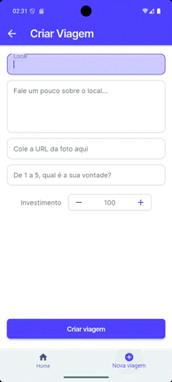
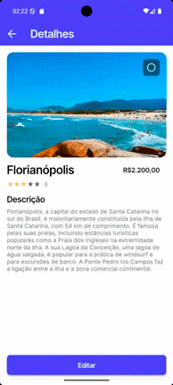
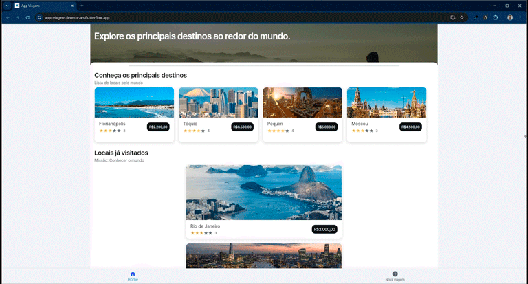

#   App Viagens | FlutterFlow + Firebase  

[](https://github.com/leomoraesitu/app-viagens/releases/tag/v1.0.0)
[](https://github.com/leomoraesitu/app-viagens/releases)
[](./CHANGELOG.md)


> Aplicativo de viagens desenvolvido em **FlutterFlow + Firebase**.

🌐 **Versão Web**: [(https://app-viagens-leomoraes.flutterflow.app)](https://app-viagens-leomoraes.flutterflow.app/)  
📱 **Baixar APK:** [Release v1.0.0](https://github.com/leomoraesitu/app-viagens/releases/tag/v1.0.0)  
📄 **Histórico de versões:** [CHANGELOG.md](./CHANGELOG.md)

---

## 📖 Sobre o projeto
O **App Viagens** foi desenvolvido durante o curso **Formação FlutterFlow** da [NoCode StartUp](https://nocodestartup.io/).  
O objetivo é aplicar princípios de **engenharia de software**, **versionamento de código**, **integração com Firebase** e **boas práticas de UI/UX** usando o framework Flutter.

O app permite:
- **Criar, listar, visualizar detalhes e editar** destinos de viagem
- **Favoritar** locais de interesse

---

## 📱 Demonstração das telas

| Home | Criar Viagem | Detalhes | Editar |  Versão Web  |
|--------------|--------------|--------------|--------------|--------------|
|  |  |  |  |  |

---

## ⚙️ Funcionalidades
- 📌 **CRUD** de roteiros de viagem  
- ⭐ **Favoritar destinos**  
- ☁️ **Integração com Firebase Firestore**  
- 🎨 Interface desenvolvida no **FlutterFlow** com customizações em **Dart**

---

## 🏗️ Arquitetura & Boas Práticas
- Uso de **App State** e **Data Types/Enums** no FlutterFlow  
- **Componentização** e reutilização de widgets  

---

## 💻 Tecnologias Utilizadas


---

## ▶️ Como executar localmente
1. Clone o repositório:
   ```bash
   git clone https://github.com/leomoraesitu/app-viagens.git
   cd app-viagens
    ````

2. Abra no **FlutterFlow** ou no **VS Code / Android Studio**.
3. Configure o **Firebase**:

   * Android → `android/app/google-services.json`
   * iOS → `ios/Runner/GoogleService-Info.plist`
   * **Importante:** não versione esses arquivos (adicione ao `.gitignore`).
4. Rode o app:

   ```bash
   flutter pub get
   flutter run
   ```

---

## 🌐 Configuração de Ambientes

📘 [Configuração do Ambiente de Produção](docs/environments/environment_configuration_production.md)

> Este documento descreve as variáveis, integrações e boas práticas utilizadas no ambiente **Production**, incluindo estrutura do Firebase e GA4.  
> As chaves e tokens reais **não são versionados** — apenas os nomes e propósitos das variáveis.

---

## 🧩 Estrutura do Projeto

```
AppViagens2/
 ├─ .dart_tool/            → configs Dart programming language
 ├─ .github/               → configs GitHub
 │   ├─ PULL_REQUEST_TEMPLATE/           → dir Pull Request Templates
 │   │   ├─ chore_pr.md                  → Chore Pull Request Template
 │   │   ├─ docs_pr.md                   → Docs Pull Request Template
 │   │   ├─ feature_pr.md                → Feat Pull Request Template  
 │   │   └─ hotfix_pr.md                 → HotFix Pull Request Template
 │   └─ pull_request_template.md         → Pull Request Template
 ├─ android/               → configs Android
 ├─ assets/                → arquivos anexos ao projeto
 ├─ docs/                  → docs do projeto
 │   └─ environments/      → dir environments
 │       └─ environment_configuration_production.md  → documentação de configuração do ambiente Production
 ├─ firebase/              → configs Firebase
 ├─ ios/                   → configs iOS
 ├─ lib/
 │   ├─ backend/           → configs schema/firebase
 │   ├─ flutterflow/       → utilitários, tema, rotas
 │   ├─ pages/             → models / widgets
 │   ├─ shared_u_i/        → componentes reutilizáveis
 │   ├─ index.dart         → Export pages
 │   └─ main.dart          → ponto de entrada
 ├─ screenshots/           → GIFs de demonstração
 ├─ test/                  → dir Testes
 ├─ web/                   → configs Web
 ├─ .flutter-plugins       → configs Flutter
 ├─ .flutter-plugins-dependencies  → configs Flutter
 ├─ CHANGELOG.md           → histórico de mudanças notáveis neste projeto
 ├─ README.md              → infos gerais do projeto
 ├─ analysis_options.yaml  → infos analyzer
 └─ pubspec.yaml           → Flutter dependencies
```

---

## 📌 Roadmap

* [ ] Implementar autenticação com Login via **e-mail/senha** (Firebase Auth)
* [ ] Criar tela de **Perfil do Usuário**, com edição de nome e fotos (FlutterFlow/Firebase Firestore, Storage)
* [ ] Upload de PDF
* [ ] Integração com Google Maps

---

## 🗺️ Releases

As versões são publicadas em **GitHub Releases**:
[https://github.com/leomoraesitu/app-viagens/releases](https://github.com/leomoraesitu/app-viagens/releases)

---

## 📜 Histórico de Versões

| Versão | Data | Principais mudanças | Link |
|:-------|:------:|:--------------------|:------|
| **v1.1.0-planned** | — | 🔄 Em desenvolvimento: autenticação por e-mail/senha, tela de perfil, upload de PDF e integração com Google Maps. | [Ver Release](https://github.com/leomoraesitu/app-viagens/releases/tag/v1.1.0-planned) |
| **v1.0.0** | 14/10/2025 | 🚀 Primeira release estável: CRUD de roteiros, favoritos, layout responsivo e versão web. | [Ver Release](https://github.com/leomoraesitu/app-viagens/releases/tag/v1.0.0) |

> 📄 Veja o histórico completo de alterações no arquivo [**CHANGELOG.md**](./CHANGELOG.md).

---

### 💡 Destaque

> Este projeto foi desenvolvido como **prova de conceito de portfólio**, evidenciando proficiência em **engenharia de software**, **boas práticas de versionamento**, **integração com Firebase** e **design orientado à experiência do usuário (UX)**.

---

## 🧑🏿‍💻 Autor

**Leonardo de Moraes Souza**
📍 Desenvolvedor FlutterFlow + Firebase | Análise e Desenvolvimento de Sistemas (FATEC Itu)

🔗 [Portfólio](https://github.com/leomoraesitu)

🔗 [LinkedIn](https://www.linkedin.com/in/leomoraesitu)

---

## 🏁 Licença
Este projeto é de uso educacional e demonstrativo.  
© 2025 Leonardo de Moraes Souza – Todos os direitos reservados.
